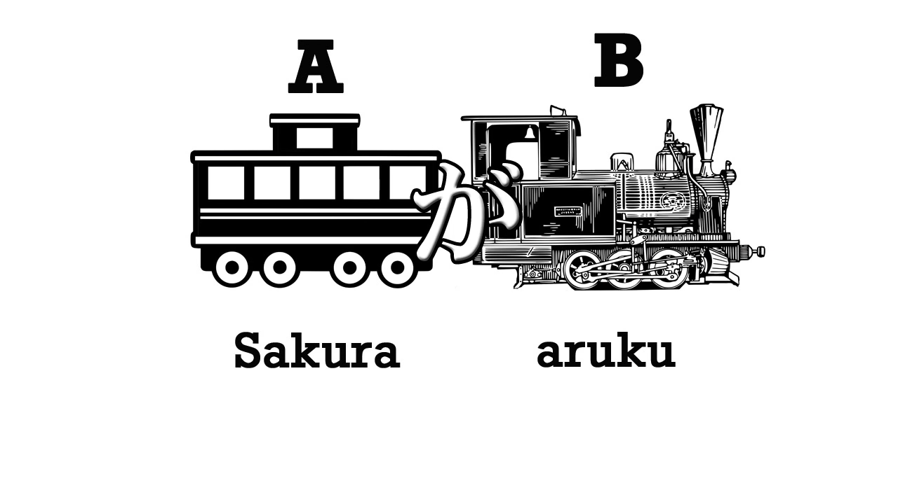
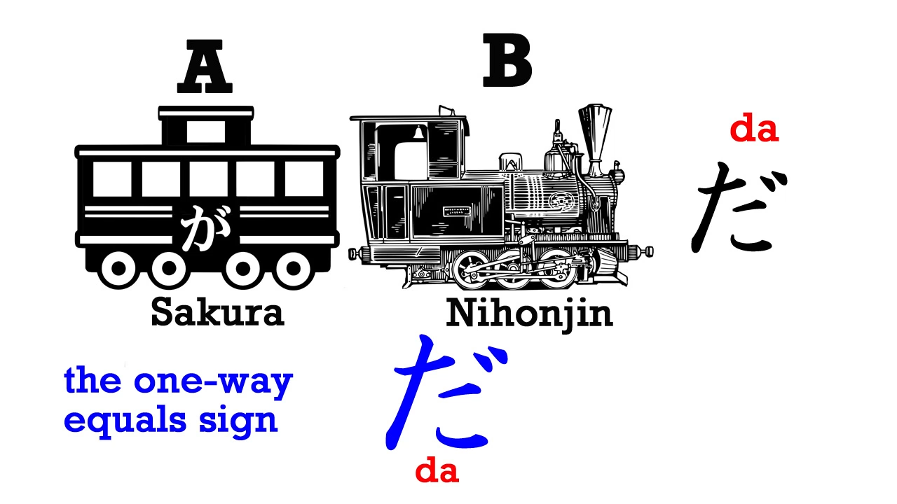
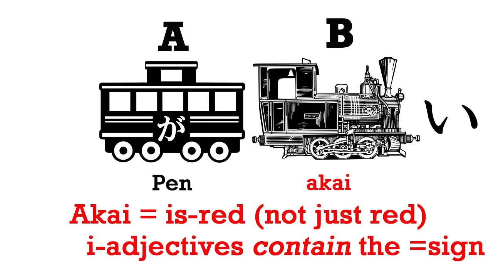
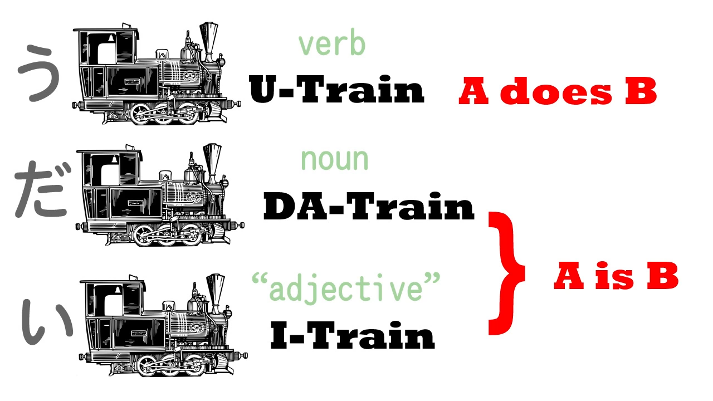

# **1. Jenis-jenis Kalimat Dasar**

[**Lesson 1: Japanese made easy! What schools never teach. The core Japanese sentence -organic Japanese**](https://www.youtube.com/watch?v=pSvH9vH60Ig&list=PLg9uYxuZf8x_A-vcqqyOFZu06WlhnypWj&ab_channel=OrganicJapanesewithCureDolly)

Hal paling mendasar tentang bahasa Jepang adalah inti kalimat bahasa Jepang. Pada dasarnya setiap kalimat dalam bahasa Jepang memiliki inti yang sama. Seperti apa? Seperti ini.

Kita akan membayangkannya seperti kereta. Setiap kalimat dalam bahasa Jepang punya dua elemen ini: **Gerbong utama, A** dan **Lokomotif / Mesin, B**. 

**Mesin adalah elemen yang membuat sebuah kalimat bergerak, yang membuat kalimat berfungsi.** Kedua elemen itu adalah inti dari seluruh kalimat dalam bahasa Jepang.

Kita bisa mengatakan lebih banyak tentang A; Kita bisa mengatakan lebih banyak tentang B; Kita bisa menggabungkan kalimat-kalimat logis untuk membuat kalimat yang kompleks. **Tapi seluruh kalimat dalam bahasa Jepang selalu mengikuti tipe dasar ini**

Jadi apa itu A dan B? Mari kita ingatkan kembali diri kita masing-masing kalau di dalam bahasa apapun hany ada dua tipe kalimat: kalimat <code>A adalah B</code> dan kaliamt <code>A melakukan B</code>

Contoh kalimat <code>A melakukan B</code> : <code>Sakura berjalan</code>

Contoh kalimat <code>A adalah B</code> : <code>Sakura adalah orang Jepang</code>

Dan kita bisa merubah kalimat tersebut ke bentuk lampau; kita bisa merubah mereka menjadi negatif; kita bisa merubah mereka menjadi pertanyaan; kita bisa menjelaskan lebih tentang A; kita bisa menjelaskan lebih tentang B. Tapi 

**Pada akhirnya, semua kalimat berasal dari salah satu dari kedua kalimat ini: <code>A melakukan B</code> dan <code>A adalah B</code>**

Jadi mari kita lihat bagaimana kita melakukan ini di bahasa Jepang.

## Verb Sentences / Kalimat Kata Kerja

Di dalam bahasa Jepang, kalau kita ingin mengatakan <code>Sakura berjalan</code> (A melakukan B: Sakura berjalan), maka A adalah Sakura, Gerbong utamanya, dan B adalah berjalan, hal yang dia lakukan, mesin dari kalimat tersebut. 

Berjalan di dalam bahasa Jepang adalah <code>あるく</code>. Kita butuh satu hal lagi untuk melengkapi kalimat dalam bahasa Jepang, dan **yang merupakan inti dari setiap kalimat, が** (ga). 

**が adalah pusat dari tata bahasa Jepang. Setiap kalimat dalam bahasa Jepang berkisar pada が. DI beberapa kalimat kita tidak akan bisa melihat が, tapi が selalu ada disana, dan selalu melakukan pekerjaan yang sama**

**が menghubungkan A dan B dan merubah mereka menjadi sebuah kalimat**

Jadi kalimat <code>A melakukan B</code> adalah <code> **さくらが**あるく</code> = <code>**Sakura** berjalan</code>.

## Copula sentences / Kalimat kopula

Now let's take an A is B sentence: <code>Sakura is Japanese</code>, or, as we say, <code>Sakura is a Japanese person</code>. So, A again is Sakura, B is にほんじん/日本人, which means Japanese person, and **once again we need が to link them together. So we're going to picture the A car, the main carriage, with a が on it, because the main carriage, the subject of the sentence, always carries a が, to link it to the engine.**

So, さくらが日本人 – and we need one more thing. There's one other thing that I want you to make friends with, and that's だ (da). <code>さくらが日本人だ</code> = <code>Sakura is a Japanese person</code>.

Now, you may have met this だ in its fancy form, です, but there are very good reasons for learning the plain, simple form first. So we're going to learn だ. Now if you look at だ, it's like an equals sign boxed off to the left. And this is a perfect mnemonic for what it does, because **だ tells us that A is B.**

Why is it boxed off to the left? Because it only works one way. Think about this logically: さくらが日本人だ means <code>Sakura = Japanese person.</code> But it doesn't work the other way: Japanese people are Sakura – they're not all Sakura. Sakura is a Japanese person, but a Japanese person is not necessarily Sakura.

## Adjective sentences

So now we have an <code>A is B</code> sentence and an <code>A does B</code> sentence. There is one more form of the Japanese core sentence, for it has three forms. The third form is when we have a describing word, an adjective.

**In Japanese, describing words end with い** (i), just as they often do in English: happy, sunny, cloudy, silly. In Japanese it's just the same: happy – うれしい/嬉しい; sad – かなしい/悲しい; blue – あおい/青い.

Now, we don't have to learn all these, but we do need to know about Japanese adjectives ending in い because they make the third kind of sentence. So let's take an easy one: ペン (that's a nice easy word because it means pen) – <code>ペンが赤い/あかい</code> = <code>pen is red</code>.

Now, you notice that we don't have a だ on this sentence. Why is that? **Because the い-adjective あかい/赤い (red) – it doesn't mean red, it means is-red. The だ function, the equals function, is built into those い-adjectives.**

So those are the three forms of Japanese sentence. **They all start with the subject of the sentence, they're all connected with が**, and they can end in three ways: with a verb, which will end in う, with the copula だ, or with an い because the last word is an adjective. And now you know the basics of Japanese.

