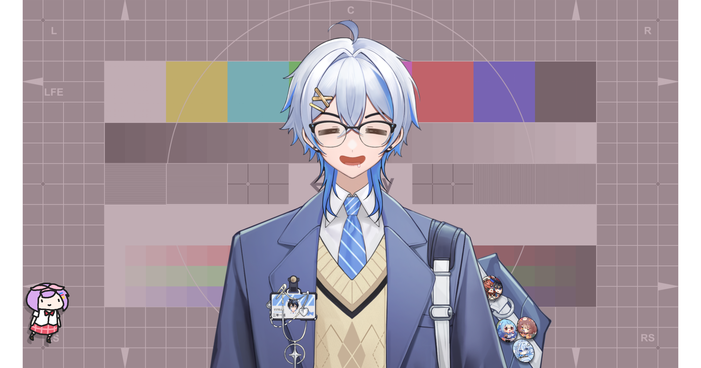

---
hide:
  - footer
  - toc
  - navigation
---

#Learn How To Learn Japanese

  

    
  

  

    <h3>NA SENA / ナ・世那</h3>
    
Aku akan memberi tahu kalian cara belajar bahasa Jepang yang efektif agar kalian tidak membuang-buang waktu kalian dengan percuma.

  

[Mulai Belajar](guide/main_guide.md){ .md-button .md-button--primary }

