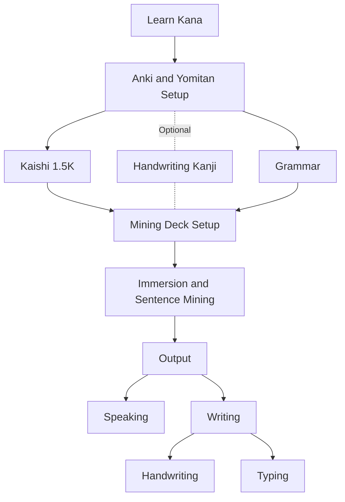
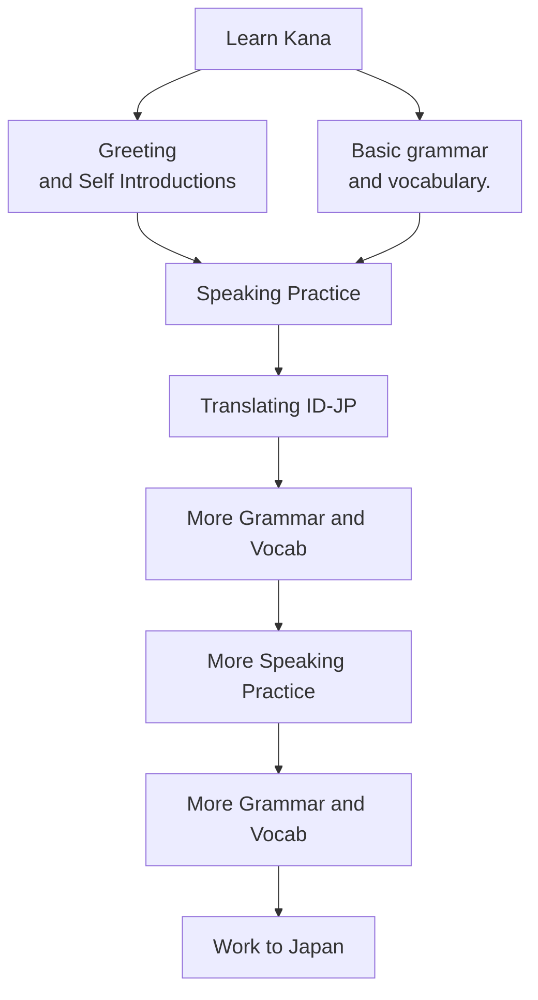

# Flowchart Immersion Based Learning

# Flowchart Traditional Based Learning

## Belajar Kana

### Hiragana

### Katakana

## Setup Anki dan Yomitan

## Belajar Kanji

## Belajar Kosa Kata
## Grammar
## Immersion 
## Sentence Mining
## Output
### Writing
### Speaking 