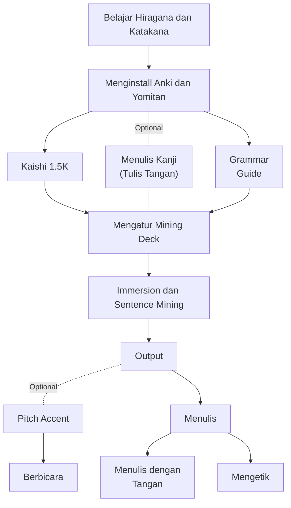

# Flowchart Immersion Based Learning

Di halaman ini, aku akan menampilkan sebuah roadmap yang biasa dilakukan oleh orang yang mempelajari bahasa Jepang menggunakan metode immersion.

## Belajar Hiragana dan Katakana

Bahasa Jepang menggunakan 4 alfabet

1. Hiragana (平仮名)

2. Katakana (片仮名)

3. Kanji (漢字)

4. Romaji (ローマ字)

Hal pertama yang harus dilakukan adalah mempelajari Hiragana dan Katakana. Setelah kita sudah bisa membaca dan menulis Hiragana dan Katakana kita akan lanjut ke langkah berikutnya.

### Hiragana

### Katakana

## Setup Anki dan Yomitan

Langkah ini membutuhkan waktu yang cukup lama untuk menginstall dan mengaturnya karena cukup rumit, tapi ini merupakan langkah yang paling penting karena Anki dan Yomitan adalah alat paling penting untuk belajar bahasa Jepang. Untuk panduannya kalian bisa klik [Di Sini](anki.md)

## Belajar Kanji
Mungkin sebelum kalian datang ke sini kalian tahu kalau satu huruf Kanji memiliki banyak cara baca. 

Contoh 

Kanji 生

On Yomi (Bacaan China) : セイ、 ショウ

Kun Yomi (Bacaan Jepang) :  い.きる、 い.かす、 い.ける、 う.まれる、 うま.れる、 う.まれ、 うまれ、 う.む、 お.う、 は.える、 は.やす、 き、 なま、 なま-、 な.る、 な.す、 む.す、 -う

Terus bagaimana cara menghafalnya? bagaimana cara memilih bacaan mana yang tepat? Kita harus pakai on yomi atau pakai kun yomi?

Jawabannya : Tidak, kita tidak akan menghafalkan bacaan dari suatu kanji satu demi satu karena hal itu tidak akan efektif dan membuang-buang waktu. 

Selain itu, kalaupun kalian bisa menghafalkan semua On yomi, dan Kun yomi yang ada di atas, hal itu tidak akan membuat kalian bisa membaca kanji 生 ketika kalian melihatnya di sebuah teks.

Lalu bagaimana cara belajar kanji yang benar? Bagaimana cara belajar kanji yang tepat agar kita bisa membaca kanji?

Caranya adalah kita belajar menghafal kanji melalui Kosakata. 

Kita akan menggunakan contoh kanji 生 yang ada di atas. 

<ruby style="font-size: 1.3em;">生きる<rt style="font-size: 0.75em;">いきる</rt></ruby>

<ruby style="font-size: 1.3em;">生まれる<rt style="font-size: 0.75em;">うまれる</rt></ruby>

<ruby style="font-size: 1.3em;">生意気<rt style="font-size: 0.75em;">なまいき</rt></ruby>

<ruby style="font-size: 1.3em;">生かす<rt style="font-size: 0.75em;">いかす</rt></ruby>

<ruby style="font-size: 1.3em;">生える<rt style="font-size: 0.75em;">はえる</rt></ruby>

<ruby style="font-size: 1.3em;">生物<rt style="font-size: 0.75em;">せいぶつ</rt></ruby>

Coba kalian perhatikan lagi, bacaan kanji 生 berbeda tergantung dari huruf yang mengikutinya.

Kalau kanji 生 + きる　maka sudah pasti bacaannya いきる tidak mungkin せいきる 生きるaatapun うきる.

Begitu juga kalau kanji 生 + まれる maka sudah pasti bacaannya うまれる, tidak mungkin いまれる、せいまれる ataupun yang lainnya. 

Bacaan kanji berubah tergantung dengan pasangannya. 

!!! Note ""

    Sama seperti kalian yang sifatnya suka berubah-rubah tergantung siapa lawan bicara kalian. 

Cara baca kanji juga berubah ketika pasangannya berubah.

Karena itu kalau kita belajar kanji dengan cara menghafal kosakata, kita akan langsung mendapatkan 2 hal 

1. Kita mempelajari kosakata 

2. Kita mempelajari cara baca kanji 

Jadi kalau kalian menghafal 6 Kosakata di atas, selain kalian mendapatkan 6 Kosakata, kalian juga akan mendapatkan 6 cara baca kanji 生 yang berbeda. 

Tapi kalau kalian menghafalkan on yomi dan kun yomi dari kanji 生, selain kalian tidak mendapatkan kosakata, kalian juga tidak akan bisa membaca kanji 生 karena kalian tidak tahu bacaan mana yang harus digunakan. 

Untuk mempelajari kanji, kita harus melakukan langkah yang berikutnya, yaitu Kaishi 1.5K.

## Kaishi 1.5K

## Grammar Guide

## Immersion 

## Sentence Mining

## Output

### Writing

### Speaking 